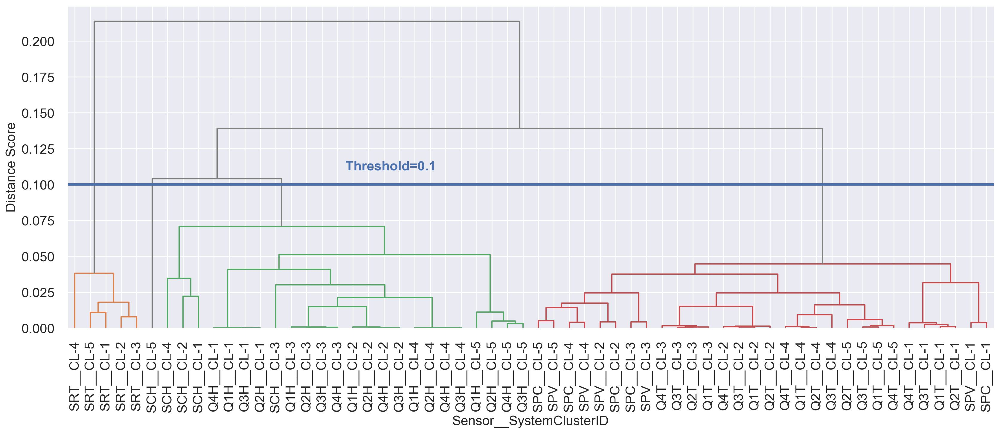

# LIDD: Lightweight Multi-System Multivariate Interconnection and Divergence Discovery
## Code is coming soon!!!

LIDD is a tool that identifies abnormal behavior in multi-system environments. 
Identifying outlier behavior among sensors and subsystems is essential for discovering faults and facilitating diagnostics in large systems. 
At the same time, exploring large systems with numerous multivariate data sets is challenging. 
LIDD employs a multivariate analysis technique that first estimates the similarity heatmaps among the sensors for each system and then applies information retrieval algorithms to provide relevant multi-level interconnection and discrepancy details. 

You can read the paper <a href="https://arxiv.org/pdf/2404.08453">here.<a>

## Use case study on the CMS Experiment at the LHC at CERN

Schematic of the CMS experiment


The frontend data acquisition chain of the Hcal Endcap (HE)


The LIDD approach for systems and sensors interconnection and divergence discovery


The RBX multi-system pairwise similarity heatmap ($D^m$). The color bar shows the score, the normalized Euclidean distance between $I_k^s$ of systems. The color gradient uses $: v_{min}=Min(D^m), v_{max}=Max(D^m), steps=256$.


The RBX system clustering ($C^m$), using $\textit{hierarchical agglomerative clustering}$ on $D^m$. The clustering demonstrates the similarity and divergence among the systems. The threshold at $\alpha^m=0.007$ generates five clusters ($N_{\xi}$=5): $\textcolor{orange}{CL-1}$, $\textcolor{green}{CL-2}$, $\textcolor{red}{CL-3}$, $\textcolor{violet}{CL-4}$, and $\color{gray}{CL-5}$, where the $CL-i$ denotes the $i^{th}$ cluster.


Using dimension reduction (36 $\rightarrow 2$ embedded feature vectors) on the similarity distance score $D$ using (top-left) PCA, (top-right) t-SNE, and (bottom-center) UMAP.


Multivariate sensor interconnection clustering dendrogram per RBX system cluster using sensor clustering threshold $\alpha^s=0.05$. 
The average over the system clusters indicates substantial discrepancies in the SRT and SCH sensors.
!


The heatmap of the RBX system clusters interconnection on the multivariate sensors. The group boxes show the interconnection strength of the sensors on the x-axis for system clusters on the y-axis. 
The divergent colors within each box indicate outlier characteristics, e.g., $SCH$, $Q[1-4]H$, and $Q[1-T]$ sensors.


Dendrogram of sensor interconnections across RBX system clusters at $\alpha^s=0.1$. 
The sensor clustering can be adjusted by increasing and decreasing the $\alpha^s$ to capture solid and subtle differences, respectively, among the clusters. 



Divergence root-cause detection using the difference in sensor interconnections among the RBX systems clusters. Plots a) illustrate the sensor divergence score $\psi^s_\nu$ of each system cluster, and the color bars show the strength of discrepancy. The plots in b) and c) are the aggregate divergence scores $\bar{\psi}^s_\nu$ and the root-cause flags after threshold $\alpha^\phi=0.15$, respectively. The plots indicate the noticeable divergence in the SCH sensors in all clusters, Q[1-4]H in CL-1 and CL-5, and SRT in CL-4.


Sensor data of the RBX system clusters $1,\dots,5$ (top to bottom). Diverging patterns in the SCH across the clusters in October and November; bigger humps on the Q[1-4]H at the beginning of September and smaller jumps on the Q[1-4]T, SPV, and SPC in cluster-1 at the end of September. The root-cause sensors that contributed most to the system clustering divergence are highlighted in the red boxes.


## BibTeX Citation

If you employ any part of the code, please kindly cite the following papers:
```
@article{asres2024lightweight,
  title={Lightweight Multi-System Multivariate Interconnection and Divergence Discovery},
  author={Asres, Mulugeta Weldezgina and Omlin, Christian Walter and Dittmann, Jay and Parygin, Pavel and Hiltbrand, Joshua and Cooper, Seth I and Cummings, Grace and Yu, David},
  journal={arXiv preprint arXiv:2404.08453},
  year={2024}
}
```
